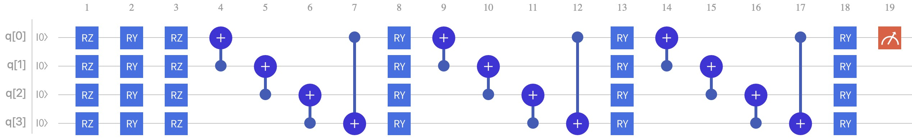
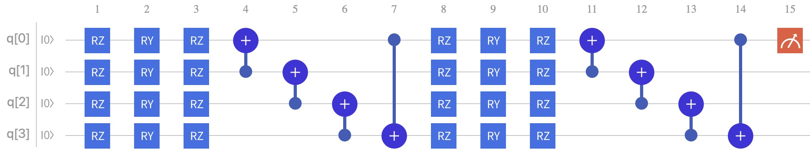

# A Simple Quantum Variational Neural Network

在这个Github库中，记录的是一个较为简单的量子变分神经网络搭建与训练过程，

这里并不会有太多的理论解析，我希望的这只是一个实用的 Journey

那么，我们开始：

----

- #### 环境配置

环境要求：

| Software | version          |
| :------: | ---------------- |
|   GCC    | >= 5.4.0         |
|  Python  | >= 3.8 && <=3.11 |

##### pyqpanda：

如果安装好了python环境和pip工具，在终端或者控制台输入下面命令：

```shell
pip install pyqpanda
```

##### VQNet：

```shell
pip install pyvqnet --index-url https://pypi.originqc.com.cn
```

安装测试

```python
import pyvqnet
from pyvqnet.tensor import *
a = arange(1,25).reshape([2, 3, 4])
print(a)
```

----

- #### 基础理论部分

关于量子计算的基础理论，我会默认认为你已经进行过学习。

如果没有，请放心，我已经给你准备好了，请阅读 [这里](ref/量子计算与编程入门.pdf)

ps: 文件过大无法上传Github，网页版 https://quantum-book-by-originq.readthedocs.io/en/latest/

----

- #### 数据预处理

这里记录的是公开数据集 MNIST。

MNIST数据集是一个大型手写数字数据库，包含60000张训练图像和10000张测试图像，通常用于训练各种图像处理系统。所有的手写数字图片的分辨率为**28*28**。

MNIST官方地址为：http://yann.lecun.com/exdb/mnist/

|     数据集     |         MNIST文件          |                          下载地址                           |  文件大小   |
| :------------: | :------------------------: | :---------------------------------------------------------: | :---------: |
| Training image | train-images-idx3-ubyte.gz | http://yann.lecun.com/exdb/mnist/train-images-idx3-ubyte.gz | 9912422字节 |
| Training label | train-labels-idx1-ubyte.gz | http://yann.lecun.com/exdb/mnist/train-labels-idx1-ubyte.gz |  28881字节  |
| Testing image  | t10k-images-idx3-ubyte.gz  | http://yann.lecun.com/exdb/mnist/t10k-images-idx3-ubyte.gz  | 1648877字节 |
| Testing label  | t10k-labels-idx1-ubyte.gz  | http://yann.lecun.com/exdb/mnist/t10k-labels-idx1-ubyte.gz  |  4542字节   |

不过并不建议使用url下载或去官方地址下载，懂得都懂...

数据预处理的细节请看 [这里](./src/dataloader/README.md)

----

- #### 量子变分线路搭建

##### QCL:



##### QVC:



量子线路搭建的细节请看 [这里](./src/model/README.md)

----

- #### 模型训练

在我们的案例中只是一个简单的体验，因此并没有提供命令行参数列表

training：

```shell
python src/train.py
```

模型训练的细节请看 [这里](./src/README.md)

----

- #### 结果

针对不同量子比特数和数据集尺寸的模型训练准确率

```python
# All experiments are carried out on the CPU
# Runtimes is the time required for single image training.
# Scheme		bitlist		img_size	weights		runtimes		Accuracy
# 振幅编码 	 4量子比特   4*4       24(6)			0.014s			 0.94
# 振幅编码	 5量子比特	 5*5			 30(6)		  0.024s			 0.94
# 振幅编码	 16量子比特	 16*16		 96(6)			5.324s			 --
# 像素编码	 16量子比特	 4*4			 96(6)			2.520s			 0.91
# 像素编码	 16量子比特	 4*4			 192(12)		11.08s			 --
# 像素编码	 25量子比特	 5*5			 150(6)			--s				 	 --
```

