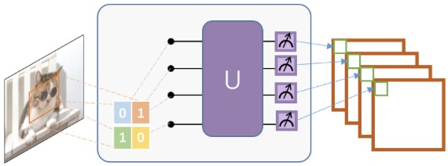
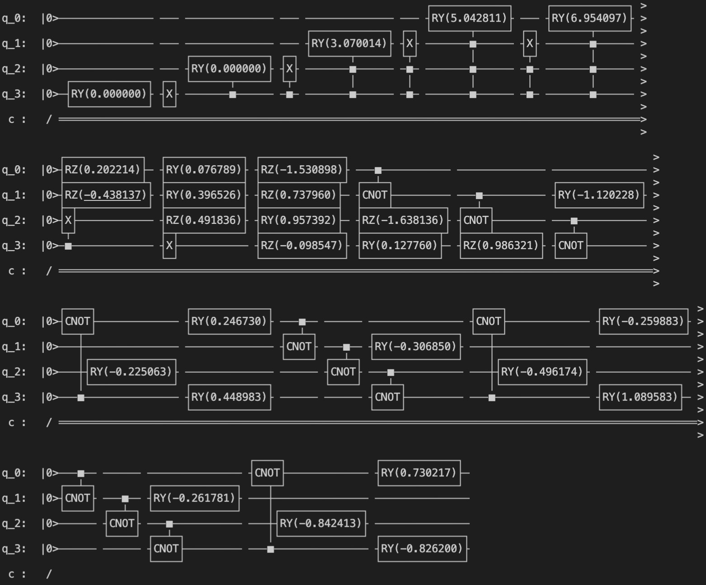

# Quantum Variational Line Construction

量子线路是一种基本的电路架构，量子变分线路由多个旋转逻辑门以及纠缠每个量子位的CNOT门组成。



这里我们通过构建两个量子变分线路来体验量子变分神经网络。分别为QCL和QVC，它们两个长的都比较像，所谓的量子变分线路与经典神经网络其实理解起来是一样的。经典神经网络中隐藏层中存在**权重weight**，而在量子变分线路中权重weight体现在**诸如RX、RY、RZ这些旋转门中的参数𝛩**。至于可解释性，这些旋转门组成的线路也是类似于黑盒，这方面我还没有过多的了解。

##### QCL:


##### QVC:


ps: Github网页可能无法显示图片，因为DNS污染，将整个项目下载到本地打开即可

----

那么我们开始。

以QCL为例，这里我们做一个对mnist数据集的二分类任务。

在搭建量子变分线路之前，还需要将经典数据编码到量子态上。由于量子线路本质上是不存在输入的，所谓的输入就是整个量子线路的量子初态，因此想要将经典数据作用到量子线路上的方法就是映射到量子初态上。

这里我们直接使用VQNet中集成的量子编码方式全振幅编码----AmplitudeEmbeddingCircuit()

```python
def qcl_circuits(input, weights, qlist, clist, machine):
		cir = pq.QCircuit()	# 声明量子线路
		cir.insert(AmplitudeEmbeddingCircuit(input, qlist))	# 向线路中插入量子编码
    prog = pq.QProg()	# 声明量子程序
    prog.insert(cir)	# 将量子线路插入程序中
    res = machine.prob_run_dict(prog, qlist[0], -1)	# 对第1个量子比特进行测量
    res = list(res.values())
    return res
```

有了以上代码我们现在就有了一个可运行的量子程序，程序中包含了一个全振幅编码路线，其中对第1个量子比特进行测量，可以得到一个二分类任务的预测概率( res = prob[0,1] )。如需多分类可以对多个量子比特进行测量，没多一个分类数翻一倍(参考二进制数)。

接下来是量子线路的搭建

```python
def build_circuit(weights, qubits):
    cir = pq.QCircuit()
    for i in range(len(qubits)):
        cir.insert(pq.RZ(qubits[i], weights[i][0]))
        cir.insert(pq.RY(qubits[i], weights[i][1]))
        cir.insert(pq.RZ(qubits[i], weights[i][2]))
    for d in range(3, single_line_weight):
        for i in range(len(qubits) - 1):
            cir.insert(pq.CNOT(qubits[i], qubits[i + 1]))
        cir.insert(pq.CNOT(qubits[len(qubits) - 1], qubits[0]))

        for i in range(len(qubits)):
            cir.insert(pq.RY(qubits[i], weights[i][d]))
    return cir
```

对应搭建即可，旋转门中的参数需要我们手动添加，

同时量子程序变成

```python
def qcl_circuits(input, weights, qlist, clist, machine):
		assert single_line_weight >= 3, "single_line_weight must be >= 3"
    cir = pq.QCircuit()	# 声明量子线路
    ...
    weights = weights.reshape([len(qlist), single_line_weight])
    subcir = build_circuit(weights, qlist)
    cir.insert(subcir)
    ...
    return res
```

到此，量子线路已经搭建完毕了，那么来看一下线路是不是我们需要的

```python
if __name__ == "__main__":
		input = np.random.randn(4)
    weights = np.random.randn(4, 6)
    qlist = qAlloc_many(4)
    def build_circuit(weights, qubits):
        cir = pq.QCircuit()
        for i in range(len(qubits)):
            cir.insert(pq.RZ(qubits[i], weights[i][0]))
            cir.insert(pq.RY(qubits[i], weights[i][1]))
            cir.insert(pq.RZ(qubits[i], weights[i][2]))
        for d in range(3, 6):
            for i in range(len(qubits) - 1):
                cir.insert(pq.CNOT(qubits[i], qubits[i + 1]))
            cir.insert(pq.CNOT(qubits[len(qubits) - 1], qubits[0]))

            for i in range(len(qubits)):
                cir.insert(pq.RY(qubits[i], weights[i][d]))
        return cir
    weights = weights.reshape([4, 6])
    cir = pq.QCircuit()
    cir.insert(AmplitudeEmbeddingCircuit(input, qlist))
    prog = build_circuit(weights, qlist)
    cir.insert(prog)
    prob = machine.prob_run_dict(cir, qlist[0], -1)
```

可以看到量子线路被打印出来，对比一下没有问题，从第二行末尾开始是我们需要的QCL线路，前面都是量子编码。



QVC也是差不多的方式来搭建。

----

最后是model的创建。

在前面我们已经定义了变分量子线路，下面我们希望使用到VQNet的自动微分来适配反向传播以对模型进行训练。代码如下：

```python
from pyvqnet.nn.module import Module
from pyvqnet.qnn.quantumlayer import QuantumLayer

from model.quantum_line import qcl_circuits, qvc_circuits, single_line_weight, qvc_block

class Model(Module):
    def __init__(self, raw=4, col=4):
        super().__init__()
        self.qvc = QuantumLayer(qcl_circuits, single_line_weight * (raw * col), "cpu", raw * col)
        # self.qvc = QuantumLayer(qvc_circuits, qvc_block * (raw * col) * 3, "cpu", raw * col)

    def forward(self, x):
        x = self.qvc(x)
        return x
```

首先定义了一个Model类，继承于Module。好在VQNet提供了QuantumLayer类来进行自动微分的量子计算层，它可以自动分析量子线路并提供随机权重和反向传播。第一个参数qcl_circuits为量子线路，第二个参数为参数的个数，“cpu”表示使用全振幅CPU模拟器，第四个参数为量子比特数。